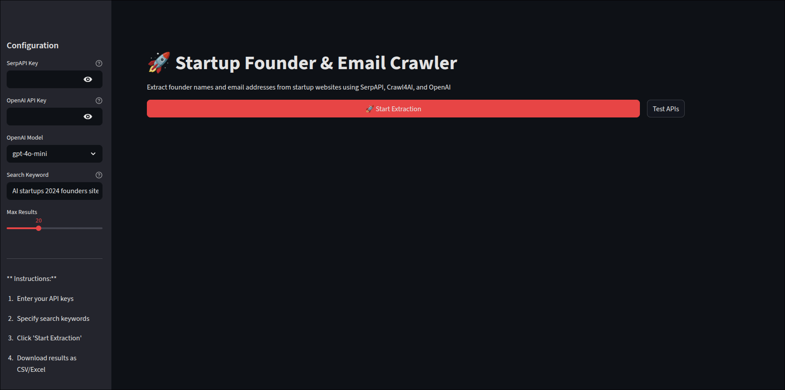

# Startup Founder Extractor

## Overview
This project uses Crawl4AI to automate web crawling and data extraction, retrieving founder names and email addresses from startup websites based on a keyword search. It integrates SerpAPI for Google search results, BeautifulSoup for HTML parsing, NLTK for natural language processing, and OpenAI for enhanced data extraction.

## Features
- Keyword Search: Searches Google via SerpAPI for a specified keyword (e.g., "AI fintech startups 2025").
- Pagination: Retrieves up to 20 search results across multiple pages.
- Web Crawling: Navigates to "About Us" or similar pages on each website.
- Data Extraction: Extracts founder names and emails using regex and optionally OpenAI's GPT models.
- Output: Generates Excel and CSV files with results, including company names, URLs, founders, emails, and confidence scores.
- Streamlit Interface: Provides a user-friendly web interface for input and result visualization.

## How to use:
The Streamlit interface makes the tool straightforward to use:
- Enter API Keys: Input your unique API keys for SerpAPI and OpenAI in the sidebar.
- Specify Search Keywords: Provide a Google search query to find the desired type of startups.
- Click 'Start Extraction': Begin the automated workflow. The application will show its progress as it discovers and processes each website.
- Download Results: Once complete, the extracted data (Company Name, URL, Founders,Emails) is displayed in a table and can be downloaded as a CSV or Excel file.

